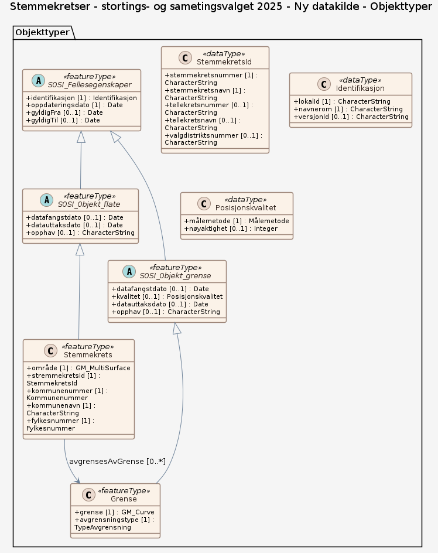

# Produktspesifikasjon: Stemmekretser - stortings- og sametingsvalget 2025

*Stemmekretsfila viser kommunenes inndeling i stemmekretser i forbindelse med stortings- og sametingsvalget i 2025. 

Datasettet inneholder  stemmekretser for kobling mot valgresultatene. På grunn av endringer i valgloven, inneholder datasettet ikke tekniske tellekretser som ved tidligere valg, der stemmekretser med mindre enn 100 manntalsførte ble slått sammen med andre kretser i tellinga.*

**Nøkkelord:** Norge, Stemmekrets, StemmekretsId, kommunenummer, fylkesnummer, stemmekretsnummer, stemmekretsnavn, valgdistriktsnummer

**Emnekategorier:** Administrative grenser

**Geografisk utstrekning**:

- **Vest**: 2.0
- **Øst**: 33.0
- **Sør**: 57.0
- **Nord**: 72.0

**Tidsmessig utstrekning**:

- **Tidsperiode**:
  - **Fra**: 2025-06-30
  - **Til**: 2025-07-04

## Om spesifikasjonen

> **Denne versjonen av produktspesifikasjonen:**  
> **Opprettet dato:** 2025-06-30 
> **Endret dato:** 2025-07-04 
> **Språk:** nor 
> **Kontaktinformasjon:** Kartverket, [post@kartverket.no](mailto:post@kartverket.no)

## Om produktet Stemmekretser - stortings- og sametingsvalget 2025

> **Romlig representasjonstype:** Vektor 
> **Unik identifikator:** 67d89aa2-ee97-43b2-bcf0-b044ac3b5844 
> **Kontaktinformasjon:** Kartverket, [post@kartverket.no](mailto:post@kartverket.no)
>
> **Romlig oppløsning:**
>
>
>
> **Begrensninger:**
>
> **Juridiske begrensninger**:
>
> - **Tilgangsbegrensninger**: Åpne data
> - **Bruksbegrensninger**: Lisens
> - **Lisens**: Creative Commons BY 4.0 (CC BY 4.0)
> - **Lisenslenke**: <https://creativecommons.org/licenses/by/4.0/>
>
> **Sikkerhetsbegrensninger**:
>
> - **Klassifisering**: Ugradert

### Formål

Vise kommunenes geografiske inndeling i stemmekretser.

### Bruksområde

Kobling mot valgresultater for å vise stemmefordeling i kommunene, fylkene eller landet. Beregning av statistikk.

## Omfang

### Hele datasettet

**Nivå**: dataset

**Nivåbeskrivelse**: Gjelder hele datasettet. Hvis omfang ikke er oppgitt under en overskrift, gjelder teksten for hele datasettet og alle leveranser

### Ny datakilde

**Nivå**: dataset

## Datainnhold og struktur

### Datamodell - Ny datakilde

➡️ [Se full datamodell for omfang "Ny datakilde" (diagram per pakke og objektkatalog)](ny-datakilde/objektkatalog.html)

## Referansesystem

| EPSG-kode | Navn på referansesystem |
| --- | --- |
| [EPSG:25832](https://epsg.io/25832) | [EUREF89 UTM sone 32, 2d](https://register.geonorge.no/epsg-koder) |
| [EPSG:25833](https://epsg.io/25833) | [EUREF89 UTM sone 33, 2d](https://register.geonorge.no/epsg-koder) |
| [EPSG:25835](https://epsg.io/25835) | [EUREF89 UTM sone 35, 2d](https://register.geonorge.no/epsg-koder) |
| [EPSG:4258](https://epsg.io/4258) | [EUREF 89 Geografisk (ETRS 89) 2d](https://register.geonorge.no/epsg-koder) |

## Datakvalitet

**Nivå**: dataset

- **Kvalitetsmål**: SOSI produktspesifikasjon: Stemmekretser
  **Målebeskrivelse**: Dataene er ikke vurdert iht produktspesifikasjonen
  **Beskrivende resultat**: Dataene er ikke vurdert iht produktspesifikasjonen

- **Kvalitetsmål**: Sosi applikasjonsskjema
  **Målebeskrivelse**: SOSI-filer er ikke vurdert i henhold til applikasjonsskjema
  **Beskrivende resultat**: SOSI-filer er ikke vurdert i henhold til applikasjonsskjema

- **Kvalitetsmål**: Sosi applikasjonsskjema
  **Målebeskrivelse**: GML-filer er ikke vurdert i henhold til applikasjonsskjema
  **Beskrivende resultat**: GML-filer er ikke vurdert i henhold til applikasjonsskjema

## Vedlikehold

**Vedlikeholdsfrekvens**: Etter behov

## Leveranse

| Tjeneste | Endepunkt | Type | Format | Leveranseenheter |
| --- | --- | --- | --- | --- |
| Geonorge nedlastning | [Lenke](https://nedlasting.geonorge.no/api/capabilities/) | GEONORGE:DOWNLOAD | FGDB, GeoJSON, GML, PostGIS, SOSI | fylkesvis, kommunevis, landsfiler |
| Atom Feed | [Lenke](http://nedlasting.geonorge.no/geonorge/ATOM-feeds/Stemmekretser_AtomFeedFGDB.xml) | W3C:AtomFeed | FGDB | fylkesvis, kommunevis, landsfiler |
| Atom Feed | [Lenke](http://nedlasting.geonorge.no/geonorge/ATOM-feeds/Stemmekretser_AtomFeedGML.xml) | W3C:AtomFeed | GML | fylkesvis, kommunevis, landsfiler |
| Atom Feed | [Lenke](http://nedlasting.geonorge.no/geonorge/ATOM-feeds/Stemmekretser_AtomFeedGeoJSON.xml) | W3C:AtomFeed | GeoJSON | fylkesvis, kommunevis, landsfiler |
| Atom Feed | [Lenke](http://nedlasting.geonorge.no/geonorge/ATOM-feeds/Stemmekretser_AtomFeedPostGIS.xml) | W3C:AtomFeed | PostGIS | fylkesvis, kommunevis, landsfiler |
| Atom Feed | [Lenke](http://nedlasting.geonorge.no/geonorge/ATOM-feeds/Stemmekretser_AtomFeedSOSI.xml) | W3C:AtomFeed | SOSI | fylkesvis, kommunevis, landsfiler |
| GeoPackage: ny-datakilde | [Lenke](https://raw.githubusercontent.com/josteinAmlien/produktspesifikasjon_test/main/produktspesifikasjon_stemmekretser/stemmekretser-2025/ny-datakilde/ny-datakilde.gpkg) | Nedlasting | GPKG |  |
| GML/XSD-skjema: ny-datakilde | [Lenke](https://raw.githubusercontent.com/josteinAmlien/produktspesifikasjon_test/main/produktspesifikasjon_stemmekretser/stemmekretser-2025/ny-datakilde/schema/xsd/INPUT/ny-datakilde.xsd) | Nedlasting | XSD |  |

## Metadata

**Metadatastandard**: ISO19115

**Metadatastandardversjon**: 2003

**Metadatadato**: 2026-09-02

**språk**: nor

**Kontakt**:

- **Organisasjon**: Kartverket
- **Kontaktperson**: Liv Mari Nesje
- **Logo**: <https://register.geonorge.no/data/organizations/971040238_Kartverket_liten.png>
- **Epost**: post@kartverket.no
- **rolle**: pointOfContact

**Metadataidentifikator**:

- **Utsteder**: Geonorge
- **kode**: 67d89aa2-ee97-43b2-bcf0-b044ac3b5844
- **koderom**: <https://kartkatalog.geonorge.no/metadata/>
- **Metadatalenke**: <https://kartkatalog.geonorge.no/metadata/67d89aa2-ee97-43b2-bcf0-b044ac3b5844>

## Tilleggsinformasjon

Trenger du hjelp til å laste ned og ta i bruk Kartverkets data og tjenester? På kartverket.no finner du tips og veiledning.

